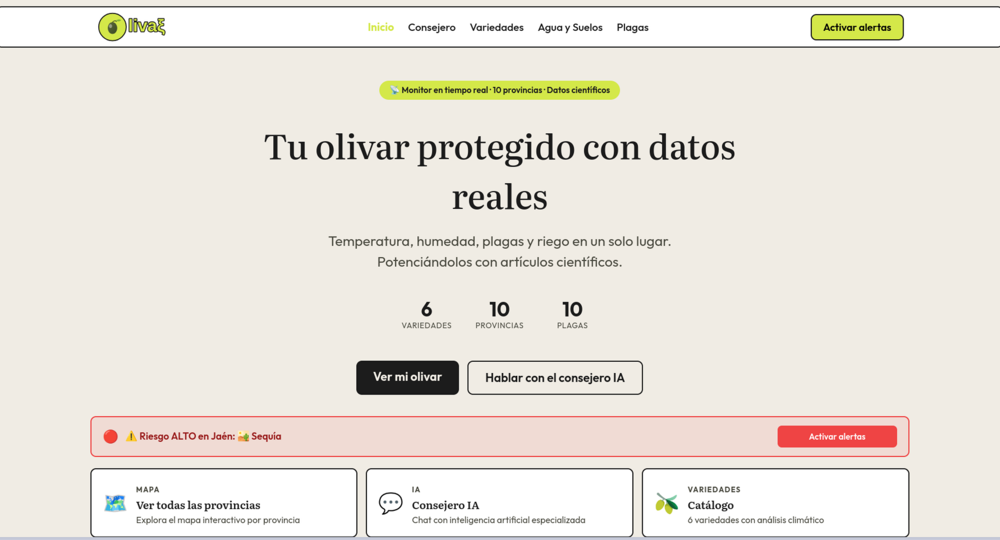
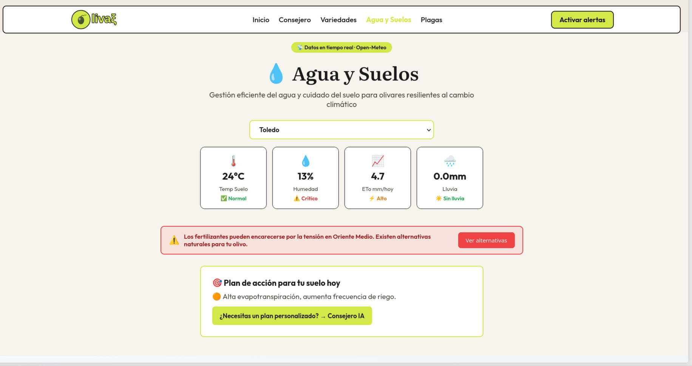
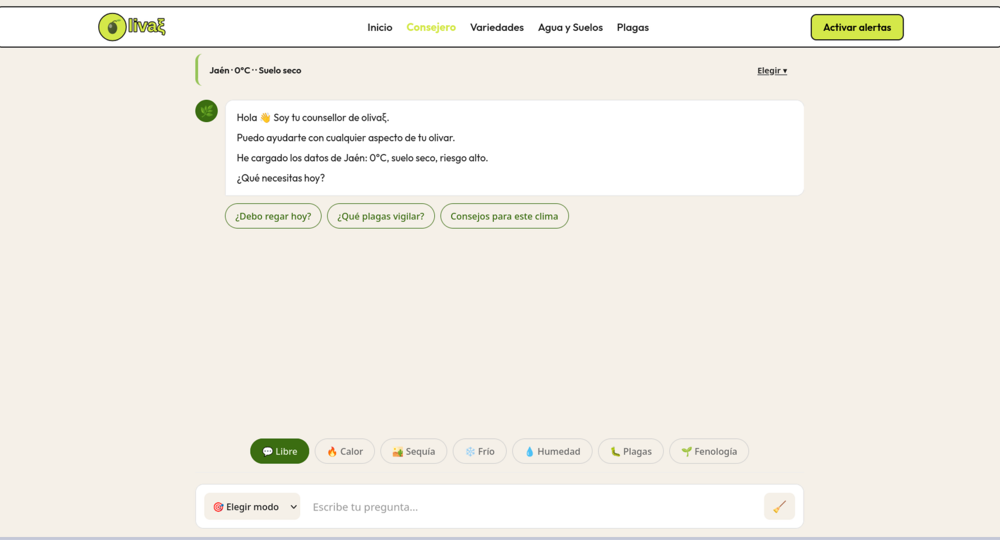

# 🫒 olivaξ — Monitor climático para olivares

Plataforma web enfocada en agricultura de precisión para olivares españoles.  
Combina clima en tiempo real, riesgo por variedad, plagas y recomendaciones prácticas para apoyar decisiones en campo.

## 🌐 Demo desplegada

Accede a la demo pública en CubePath aquí:  
👉 **[http://45.90.237.135:4321/](http://45.90.237.135:4321/)**

## ✨ Qué incluye

- 🗺️ Mapa de calor con riesgo climático por provincia
- 🧬 Catálogo de variedades con evaluación dinámica de riesgo
- 🔔 Sistema de alertas por correo (confirmación + envío inmediato/periódico) con rotación de IA entre `Cerebras`, `Cerebras_2` y `Gemini`
- 🦠 Seguimiento de plagas con contexto meteorológico
- 🤖 **Predicción ML de riesgo de mosca** (48h) con modelo RandomForest (100% precisión)
- 💧 Módulo de agua y suelos (temperatura, humedad y ETo)
- 💬 Consejero IA con contexto agroclimático en streaming y rotación automática de 3 APIs gratuitas: `Groq`, `OpenRouter` y `Gemini`

## 🧰 Stack tecnológico

- 🌌 **Frontend**: Astro 6 + SolidJS
- ⚙️ **Backend**: Bun + Hono
- 🗄️ **Datos**: SQLite (`bun:sqlite`) + Open-Meteo API
- 🧭 **Mapas**: MapLibre GL + CartoDB
- 🤖 **IA/Asistencia de desarrollo**: opncode con **MiniMax M2.5** de código abierto, lanzado por la empresa china de IA, MiniMax, en febrero de 2026

## 📡 Endpoints principales

- `GET /api/clima` → clima consolidado por provincias (con cache)
- `GET /api/clima/dashboard?provincia=...&variedad=...` → clima + suelo + riesgos + consejos
- `GET /api/alertas/tipos?provincia=...&variedad=...` → tipos de alerta sugeridos
- `GET /api/prediccion?provincia=...` → predicción ML de riesgo mosca (48h)
- `POST /api/chat` → chat del compañero con SSE
- `POST /api/alertas` y `POST /api/alertas/verify` → alta y confirmación de alertas

## 🚀 Ejecución local

### Entorno Python ML

Para el endpoint de predicción de mosca, se requiere un entorno virtual con las dependencias:

```bash
# Crear entorno virtual con uv
uv venv ml_env
source ml_env/bin/activate
uv pip install scikit-learn pandas numpy joblib requests
```

### Frontend

```bash
npm install
npm run dev
```

### Backend

```bash
bun run api/index.ts
```

## 🧪 Pruebas rápidas

```bash
curl "http://localhost:3000/api/clima/dashboard?provincia=Jaén" | jq '.'
curl "http://localhost:3000/api/alertas/tipos?provincia=Jaén&variedad=picual"
```

## 🔐 Variables de entorno

```env
GROQ_KEY=
GEMINI_KEY=
OPENROUTER_KEY=
GMAIL_USER=
GMAIL_APP_PASSWORD=
PUBLIC_API_URL=http://localhost:3000
PUBLIC_WEB_URL=http://localhost:4321
```

## 📦 Build

```bash
npm run build
npm run preview
```

## 🎬 Demo visual (GIF)

Vista rápida de la plataforma en funcionamiento:


## 🖼️ Capturas de pantalla

### 🏠 Inicio



### 📊 Datos climáticos



### 💬 Chat consejero



## ☁️ Despliegue en CubePath (Docploy + Compose)

Así se montó la infraestructura de `olivaxi`:

1. 🖥️ Se utilizó una instancia `gp.micro`.
2. 🐧 Se instaló **Ubuntu 22** por estabilidad del entorno.
3. 🧱 Se instaló **Docploy** en el servidor.
4. 📁 En Docploy se creó el proyecto **olivaxi**.
5. 🐳 Se eligió **Create Service** con tipo **Compose**.
6. 📤 Se subió el archivo `docker-compose.yml` con toda la configuración de backend y frontend.
7. 🚀 Desde ese Compose se levantaron los servicios de la plataforma.

## 🌱 Nota

Este proyecto prioriza rendimiento, mantenibilidad y resiliencia en la conexión frontend↔API para que los datos climáticos lleguen de forma consistente.
